# 🎤 ReLife (리마스터)

<div align="center">

**음성 명령 기반 장애인 통합 복지 플랫폼**

[](https://youtu.be/rhYzZlGEvUg)

> 🎬 **[시연 영상 보기](https://youtu.be/rhYzZlGEvUg)** - 음성 인식으로 웹을 자유롭게!

음성 명령으로 페이지를 이동하고, 복잡한 조작 없이 **복지 정보·도우미 매칭·일정 관리**를 하나로 통합

</div>

---

## 📋 목차

- [프로젝트 소개](#-프로젝트-소개)
- [팀원 구성](#-팀원-구성)
- [문제 제기](#-문제-제기)
- [해결 방안](#-해결-방안)
- [핵심 기능](#-핵심-기능)
- [주요 화면](#-주요-화면)
- [기술 스택](#기술-스택)
- [활용 라이브러리](#-활용-라이브러리)
- [프로젝트 구조](#-프로젝트-구조)
- [개발 환경](#-개발-환경)

---

## 🎯 프로젝트 소개

**ReLife**는 장애인의 디지털 접근성을 향상시키기 위한 **음성 인식 기반 통합 복지 플랫폼**입니다.

### 핵심 가치
- 🎤 **음성 명령으로 페이지 이동** - "프로그램", "활동보조" 등을 말하면 즉시 이동
- 🏥 **복지 사이트** - 프로그램·일자리·공지사항을 한곳에서 확인
- 🤝 **도우미 매칭** - 생활 지원·이동 지원 요청 및 매칭
- 📅 **통합 캘린더** - 신청한 프로그램과 개인 일정을 한눈에 관리

### 개발 기간
**2024.09 ~ 2024.12** (4개월)

---

## 👥 팀원 구성

| 이름 | 역할 | 담당 페이지 |
|------|------|-------------|
| **박진성** (팀장) | Frontend Developer | 일자리 페이지, 개인 일정 페이지 |
| **홍혜창** | Frontend Developer | 로그인/회원가입, 메인 페이지, 공지사항 |
| **배건우** | Frontend Developer | 활동보조 페이지, 마이 페이지 |
| **박지원** | Frontend Developer | 프로그램 페이지, 사이드바 |

---

## 📊 문제 제기

### 장애인의 디지털 소외 현황

<div align="center">
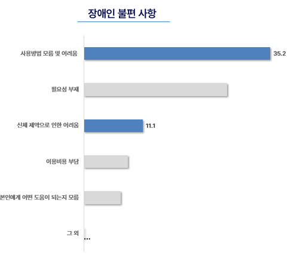
</div>

> 출처: [웰페어뉴스 - 장애인의 정보격차 수준 '심각'… 대책 필요](https://www.welfarenews.net)

**주요 문제점:**
- 📱 **사용방법 모름 및 어려움** 35.2% (1위)
- 🖱️ **신체 제약으로 인한 어려움** 11.1% (3위)
- 정교한 마우스/키보드 조작이 필요한 웹사이트는 장애인에게 큰 장벽

→ **음성 명령 기반 인터페이스로 접근성 개선 필요!**

---

## 💡 해결 방안

### 음성 인식 기반 통합 플랫폼 개발

**ReLife**는 다음과 같은 방식으로 문제를 해결합니다:

1. **음성 명령 페이지 이동**
   - 스페이스바를 누르고 "프로그램", "활동보조" 등을 말하면 즉시 이동
   - 마우스 클릭 없이 음성만으로 웹 사이트 전체 탐색 가능

2. **복지 정보 통합 제공**
   - 프로그램, 일자리, 공지사항을 한 곳에서 확인
   - 마감 임박 정보를 메인 페이지에서 바로 확인

3. **도우미 매칭 시스템**
   - 생활 지원(청소, 요리 등) 및 이동 지원 요청
   - 구글 지도 API로 위치 검색 및 경로 확인

4. **통합 캘린더**
   - 신청한 프로그램, 활동보조, 개인 일정을 한눈에
   - 드래그 앤 드롭으로 일정 조정 가능

### 기대 효과

- ✅ 간편한 UI로 **디지털 접근성 향상**
- ✅ 여러 복지 정책·서비스를 **모아서 확인 가능**
- ✅ **디지털 소외 해소** 및 장애인의 삶의 질 향상
- ✅ **사회적 인식 개선** 및 포용적 디지털 환경 조성

---

## ✨ 핵심 기능

### 🎤 음성 인식 페이지 이동 (최대 강점!)

<div align="center">

</div>

**사용 방법:**
1. 스페이스바를 누르면 녹음 시작 🎙️
2. "프로그램", "활동 보조", "일자리", "공지사항", "개인 일정", "마이페이지" 중 하나를 말하기
3. 스페이스바를 다시 누르면 녹음 중지 및 페이지 이동! ⚡

**기술 구현:**
- Web Speech API (`SpeechRecognition`)를 활용한 실시간 음성 인식
- 키워드 매칭 시스템: `keywords` 배열과 음성 텍스트를 비교하여 정확한 페이지 라우팅
- React Router와 통합된 자연스러운 페이지 전환

---

### 🎯 주요 기능 한눈에 보기

<div align="center">
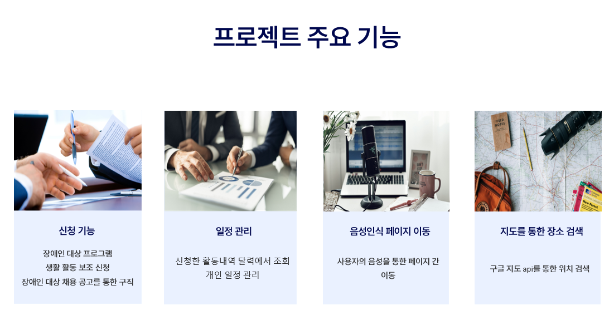
</div>

---

### 🧭 커스터마이징 가능한 사이드바

<div align="center">
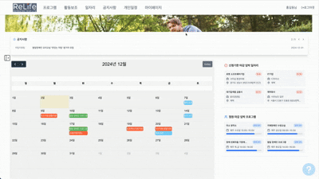
</div>

- 자주 가는 메뉴를 상단에 배치
- 드래그 앤 드롭으로 메뉴 순서 변경
- 확장/축소로 공간 효율적 사용
- 음성 명령과 연동되어 빠른 페이지 이동 가능

---

## 📱 주요 화면

### 로그인 / 회원가입

<div align="center">
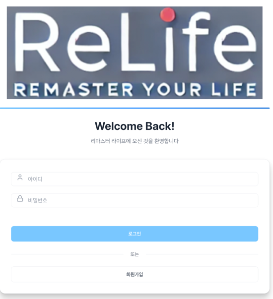
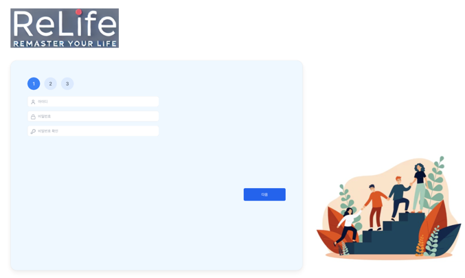
</div>

**특징:**
- `react-hook-form`으로 폼 유효성 검사 및 에러 처리
- 장애 유형 및 등급을 다중 선택 가능
- 단계별 회원가입 (3단계)

---

### 메인 페이지

<div align="center">
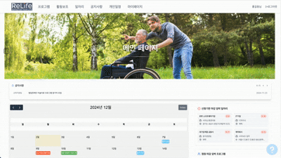
</div>

**특징:**
- 최신 공지사항 자동 슬라이드 (5초마다 전환)
- `FullCalendar`로 신청한 일정을 캘린더에 표시
- 마감 임박 프로그램 및 일자리 홍보

---

### 프로그램 페이지

<div align="center">
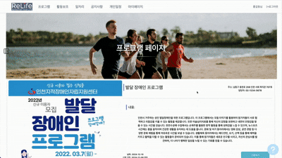
</div>

**특징:**
- `react-slick` 캐러셀로 프로그램 목록 표시
- 클릭 시 중앙에 상세 정보 표시
- 신청 버튼으로 즉시 신청 (중복 체크 포함)

---

### 활동보조 페이지

<div align="center">
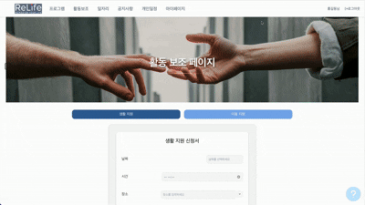
</div>

**특징:**
- 생활 지원 / 이동 지원 탭 전환
- Google Maps API (`@react-google-maps/api`)로 위치 검색
- `react-datepicker`로 날짜 및 시간 선택

---

### 일자리 페이지

<div align="center">
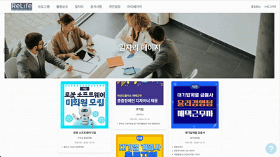
</div>

**특징:**
- 채용 공고 목록을 카드 형태로 표시
- 클릭 시 상세 페이지로 이동 (React Router의 동적 라우팅 `/job/:id`)
- 지원 버튼으로 간편 지원

---

### 공지사항 페이지

<div align="center">
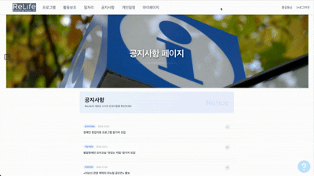
</div>

**특징:**
- 공지사항 목록을 아코디언 방식으로 표시
- 클릭 시 해당 공지 내용 펼침/접힘
- 페이지네이션으로 많은 공지사항 효율적 표시

---

### 개인 일정 페이지

<div align="center">
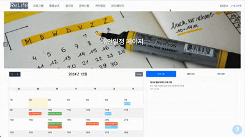
</div>

**특징:**
- `@fullcalendar/react`로 캘린더 구현
- 신청한 프로그램·활동보조가 자동으로 표시
- 드래그 앤 드롭으로 일정 시간 조정
- 개인 일정 추가·수정·삭제 모달

---

### 마이 페이지

<div align="center">
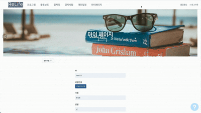
</div>

**특징:**
- 사용자 정보 수정
- 활동한 프로그램 타임라인 조회
- 프로그램·활동보조·일자리 신청 내역 조회

---

## 기술 스택

<div align="center">
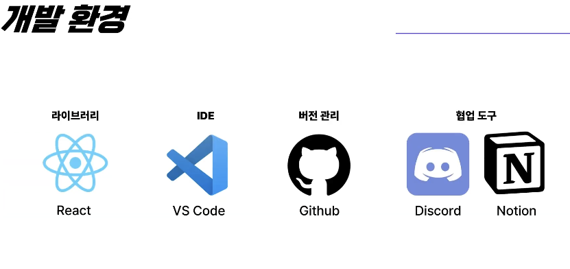
</div>

### Frontend


### Tools & Environment


---

## 📚 활용 라이브러리

### 라우팅 및 상태 관리
- **react-router-dom** `v6.28.0`
  - 중첩 라우팅 (Nested Routes)으로 레이아웃 공유
  - 동적 라우팅 (`/job/:id`)으로 상세 페이지 구현
  - `useNavigate`, `useParams` 훅으로 페이지 이동 및 파라미터 추출

### UI 컴포넌트
- **@fullcalendar/react** `v6.1.15`
  - 캘린더 UI 제공
  - 이벤트 드래그 앤 드롭 지원
  - 반복 일정 처리 (`@fullcalendar/rrule`)

- **react-datepicker** `v7.5.0`
  - 날짜 및 시간 선택 UI
  - 한국어 로케일 지원

- **react-slick** `v0.30.2`
  - 캐러셀/슬라이더 구현 (프로그램 목록)

### 폼 관리
- **react-hook-form** `v7.54.0`
  - 폼 유효성 검사 및 에러 처리
  - 간결한 코드로 복잡한 폼 관리

### 지도 API
- **@react-google-maps/api** `v2.20.3`
  - Google Maps 통합
  - 위치 검색 및 마커 표시

### 드래그 앤 드롭
- **react-beautiful-dnd** `v13.1.1`
  - 사이드바 메뉴 순서 변경
  - 부드러운 애니메이션 효과

### 아이콘
- **lucide-react** `v0.468.0`
  - 다양한 아이콘 제공 (로그인, 로그아웃, 화살표 등)

---

## 📂 프로젝트 구조

<div align="center">

</div>

```
Remaster/
├── public/
│   └── assets/
│       └── images/          # 이미지 리소스
├── src/
│   ├── components/          # 재사용 가능한 컴포넌트
│   │   ├── common/          # 공통 컴포넌트 (모달 등)
│   │   ├── job/             # 일자리 관련 컴포넌트
│   │   ├── program/         # 프로그램 관련 컴포넌트
│   │   ├── schedule/        # 일정 관련 컴포넌트
│   │   └── side/            # 사이드바 컴포넌트
│   ├── pages/               # 페이지 컴포넌트
│   │   ├── common/          # 공통 레이아웃
│   │   ├── job/             # 일자리 페이지
│   │   ├── login/           # 로그인/회원가입
│   │   ├── main/            # 메인 페이지
│   │   ├── mypage/          # 마이 페이지
│   │   ├── notice/          # 공지사항
│   │   ├── program/         # 프로그램
│   │   ├── schedule/        # 개인 일정
│   │   └── support/         # 활동보조
│   ├── data/                # 더미 데이터 (JSON)
│   ├── converter/           # 데이터 변환 유틸리티
│   ├── hook/                # 커스텀 훅
│   ├── App.js               # 라우팅 설정
│   └── index.js             # 진입점
└── package.json
```

---

## 💻 개발 환경

### 개발 서버
- **React 개발 서버**: `localhost:3000`
- **npm start**로 실행 시 Webpack Dev Server가 자동으로 실행됩니다

### 클라이언트 사이드 라우팅
- React Router가 브라우저의 History API를 사용해 페이지 이동을 처리합니다
- 실제로는 페이지가 새로고침되지 않고, JavaScript가 화면만 교체합니다
- 개발 서버는 모든 경로 요청을 `index.html`로 리다이렉트하여 SPA가 작동하도록 합니다

### 설치 및 실행

```bash
# 의존성 설치
npm install

# 개발 서버 실행
npm start

# 프로덕션 빌드
npm run build
```

---

## 🎓 프로젝트를 통해 배운 점

### React의 선언적 UI
- 상태(State) 기반으로 UI를 자동으로 업데이트하는 React의 핵심 개념 이해
- `useState`, `useEffect` 등 React Hooks를 활용한 효율적인 상태 관리

### 컴포넌트 재사용성
- 공통 컴포넌트(모달, 버튼 등)를 만들어 코드 중복 제거
- Props를 통한 데이터 전달 및 컴포넌트 간 통신

### 라우팅과 페이지 구조
- React Router를 활용한 SPA(Single Page Application) 구현
- 중첩 라우팅과 동적 라우팅으로 복잡한 페이지 구조 설계

### 외부 라이브러리 활용
- FullCalendar, Google Maps API 등 다양한 라이브러리를 프로젝트에 통합
- 라이브러리 공식 문서를 읽고 적용하는 능력 향상

### 웹 접근성의 중요성
- 음성 인식 기능을 구현하며 장애인을 위한 UI/UX의 중요성 체감
- 모든 사용자가 불편 없이 사용할 수 있는 웹의 가치 깨달음

---

<div align="center">

**Made with ❤️ by ReLife Team**

[](https://github.com/WebFramework-Remaster/Remaster)

</div>


